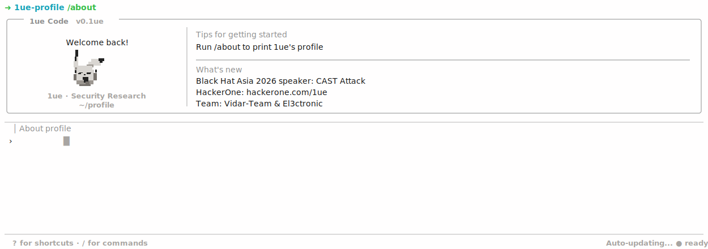

<div align="center">



<br/>

<a href="https://hackerone.com/1ue">
  
</a>
<a href="https://blackhat.com/asia-26/briefings/schedule/#cast-attack-a-new-threat-posed-by-ghost-bits-in-java-50444">
  
</a>
<a href="https://github.com/luelueking/luelueking/blob/main/SECURITY.md">
  
</a>

</div>

```txt
┌──(root㉿github)-[~/profile]
└─# ./whoami --brief

handle  : 1ue
team    : Vidar-Team & El3ctronic
focus   : Web Security / Java Security / Code Audit / Exploit Dev
talk    : CAST Attack: A New Threat Posed by Ghost Bits in Java
contact : MjMzNjQ4NTk4OAo=
```

<div align="center">


<br/><br/>


<br/><br/>


<br/><br/>

<picture>
  <source media="(prefers-color-scheme: dark)" srcset="https://raw.githubusercontent.com/luelueking/luelueking/output/github-contribution-grid-snake-dark.svg" />
  <source media="(prefers-color-scheme: light)" srcset="https://raw.githubusercontent.com/luelueking/luelueking/output/github-contribution-grid-snake.svg" />
  
</picture>

<br/><br/>


</div>
